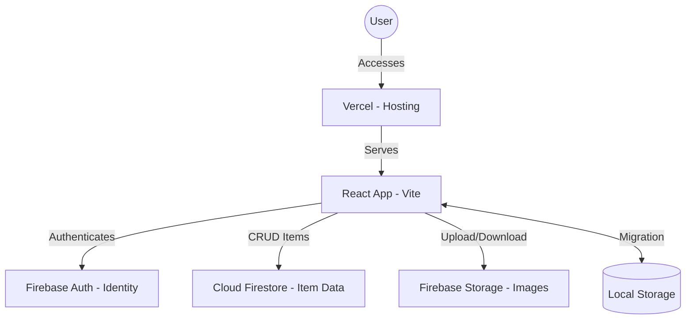

# Migration to Firebase and Vercel

Migrate the ZoueLu Collection Manager from local storage to a cloud-based solution using Firebase and Vercel.

## Architecture Overview

The application will transition from a single-user local app to a multi-user cloud app.

### Services Used
| Service | Purpose | Location |
| :--- | :--- | :--- |
| **Vercel** | Hosting the React frontend | Global (Edge) |
| **Supabase Auth** | User login and security | Frankfurt (`eu-central-1`) |
| **Supabase DB** | Storing item JSON (PostgreSQL) | Frankfurt (`eu-central-1`) |
| **Supabase Storage** | Storing image files (1GB limit) | Frankfurt (`eu-central-1`) |

> [!NOTE]
> **Why Supabase?** Since Firebase Storage now requires a credit card (Blaze plan) for the Frankfurt region, Supabase is currently the best 100% free alternative that keeps your data in Germany.

## Development & Deployment Workflow

### Development Process
1. **Local Development**: You continue to use `npm run dev` locally. The app will connect to the production Firebase during development (or we can set up Firebase Emulators for local-only testing).
2. **Feature Branches**: New features are developed in git branches.

### Deployment Process (Vercel)
- **Git Integration**: The Vercel project will be linked to your GitHub repository.
- **Automated Builds**: Every time you push to the `main` branch, Vercel automatically deploys to production.
- **Preview Deployments**: Every time you push to a *different* branch (e.g., `beta-feature`), Vercel creates a unique "Preview URL". This is your Beta version.

### Beta Testing & Preview Versions
Vercel is built for this exact scenario:
1. **Branching**: Create a branch called `beta`.
2. **Preview URL**: Vercel generates a dedicated URL (e.g., `zoelu-manager-git-beta.vercel.app`).
3. **Sharing**: You can give this URL to your testers. It will have all the new features from that branch.
4. **Promotion**: Once testing is successful, you merge the branch into `main`, and the changes go live for everyone on the production URL.

### Update Process
- **Seamless Updates**: Since it's a web app, users don't need to download updates. They just refresh the page to get the latest version.
- **Database Migrations**: Firebase (NoSQL) is flexible. Adding new fields to items doesn't require complex migrations; old items will simply lack the new fields until updated.

## User Review Required

> [!IMPORTANT]
> **Supabase Project Setup**: You will need to create a project in the [Supabase Dashboard](https://supabase.com/dashboard/) and select **"Central EU (Frankfurt)"** as the region.
> **Hosting Location**: Supabase provides Database, Auth, and Storage all in the Frankfurt region for free.
> **Storage Limit**: The free tier includes **1GB** of storage. For 25 users with 500 items each, we should ensure images are compressed (approx. 100KB per image) to stay within this limit.

## Detailed Implementation Steps

### Phase 1: Infrastructure Setup (User Action Required)
1. **Supabase Dashboard**:
   - Create a new project.
   - **Region**: Select **"Central EU (Frankfurt)"**.
   - **Database Password**: Save this safely.
2. **Storage Setup**:
   - Create a new bucket named `collection-images`.
   - Set it to **"Public"** (or we can use signed URLs for better security).
3. **Vercel**:
   - Link your GitHub repository to Vercel.

### Phase 2: Environment & Core Setup
1. **Dependencies**: Install `@supabase/supabase-js`.
2. **Configuration**: Create `src/services/supabase.ts` with your URL and Anon Key.
3. **Environment**: Create `.env` and `.env.local` files for the Supabase keys.

### Phase 3: Authentication Implementation
1. **Context/Hook**: Create a way to track the logged-in user.
2. **UI**: Create a simple `Auth` component (Email/Password login).

### Phase 4: Cloud Data Service (PostgreSQL + JSONB)
1. **Refactor `itemService.ts`**:
   - Use Supabase `.from('items').select()` to fetch data.
   - Use `.upsert()` to save data.
   - Ensure the `user_id` column is used for isolation.
2. **Image Upload logic**: Update the file picker to upload to Supabase Storage.

### Phase 5: Migration Assistant
1. **Detection**: Detect local `ZoeLuCollection`.
2. **Sync**: Upload local items to Supabase.
3. **Cleanup**: Clear `localStorage`.

### Phase 6: Finalization & Deployment
1. **RLS Rules**: Enable Row Level Security (RLS) in Supabase so users can only see their own rows.
2. **Deploy**: Push to GitHub.

## Proposed Changes

### Configuration & Setup
- [NEW] [supabase.ts](file:///c:/_ldrssn/Github/ZL-collectionmanager/services/supabase.ts): Initialize Supabase client.

---

### Authentication & Migration
- [MODIFY] [App.tsx](file:///c:/_ldrssn/Github/ZL-collectionmanager/App.tsx): Wrap the application in an Auth provider or handle auth state to gate access to the collection.
- [NEW] [Auth.tsx](file:///c:/_ldrssn/Github/ZL-collectionmanager/components/Auth.tsx): Component for Login/Signup using Firebase Auth.
- [NEW] [MigrationAssistant.tsx](file:///c:/_ldrssn/Github/ZL-collectionmanager/components/MigrationAssistant.tsx): A UI component that detects local data and offers to upload it to the cloud once the user is logged in.

---

### Data Storage (Firestore)
- [MODIFY] [itemService.ts](file:///c:/_ldrssn/Github/ZL-collectionmanager/services/itemService.ts): Replace `localStorage` logic with Firestore queries specific to the logged-in user.
- **Schema**:
  - `users/{userId}/items/{itemId}`: Individual collection items.

---

### Image Storage (Cloud Storage)
- [MODIFY] [itemService.ts](file:///c:/_ldrssn/Github/ZL-collectionmanager/services/itemService.ts): Add logic to upload image files to Firebase Storage and store the resulting URL in Firestore.

---

### Deployment
- [NEW] [vercel.json](file:///c:/_ldrssn/Github/ZL-collectionmanager/vercel.json): Vercel configuration for deployment.

## Verification Plan

### Automated Tests
- Since there are no existing tests, I will implement manual verification steps.

### Manual Verification
1. **Auth Flow**: Register a new user, log out, and log back in.
2. **Migration Assistant**: Verify that if local data exists, the app prompts the user to migrate it to the cloud.
3. **Item Creation**: Add a new item with an image and verify it appears in the Firestore console and Firebase Storage.
3. **Data Isolation**: Verify that User A cannot see User B's items.
4. **Persistence**: Refresh the page and ensure items are still loaded from the cloud.
